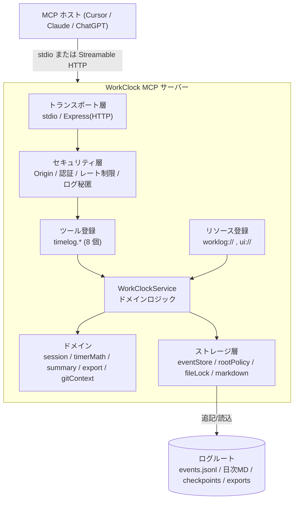

# Sugukuru WorkClock MCP — 詳細資料

ローカルファースト設計の「ポモドーロ＆作業時間ログ MCP サーバー」の完全ガイドです。
このドキュメントは、設計思想・アーキテクチャ・データモデル・全ツール仕様・セキュリティ
モデル・運用方法・公開手順までを 1 つにまとめた「読めば全部わかる」資料です。

- 対象読者: このサーバーを導入・運用・拡張する開発者、レビュアー、意思決定者
- バージョン: 1.0.0
- ライセンス: MIT

---

## 目次

1. [これは何か](#1-これは何か)
2. [なぜ作ったか（課題と狙い）](#2-なぜ作ったか課題と狙い)
3. [全体アーキテクチャ](#3-全体アーキテクチャ)
4. [データモデルとストレージ](#4-データモデルとストレージ)
5. [ツール詳細リファレンス](#5-ツール詳細リファレンス)
6. [MCP リソース](#6-mcp-リソース)
7. [MCP Apps タイマー UI](#7-mcp-apps-タイマー-ui)
8. [自然言語コマンド](#8-自然言語コマンド)
9. [セキュリティ設計](#9-セキュリティ設計)
10. [プライバシー設計](#10-プライバシー設計)
11. [トランスポートと動作モード](#11-トランスポートと動作モード)
12. [環境変数リファレンス](#12-環境変数リファレンス)
13. [エラーコード一覧](#13-エラーコード一覧)
14. [運用（バックアップ・クラッシュ復旧）](#14-運用バックアップクラッシュ復旧)
15. [開発・テスト・検証](#15-開発テスト検証)
16. [公開・デプロイ手順](#16-公開デプロイ手順)
17. [設計上の意思決定](#17-設計上の意思決定)
18. [FAQ](#18-faq)

---

## 1. これは何か

WorkClock は、AI クライアント（Cursor / Claude Desktop / ChatGPT など MCP 対応ホスト）の
チャットの中で、**自然な日本語のコマンドだけで作業時間を正確に記録**できる MCP サーバーです。

```
あなた: 設計レビュー開始
あなた: 休憩
あなた: 再開
あなた: 終了。OAuthまわりの整理まで完了
あなた: 今日の稼働まとめ
```

これだけで、タスク単位の作業時間が以下に記録されます。

- **`events.jsonl`** … 追記専用（append-only）の機械可読な台帳（信頼できる唯一の情報源）
- **日次 Markdown** … 人が読める作業ログ（イベントから自動再生成）
- **エクスポート** … CSV / JSON / 日報 / 週報 / Obsidian 形式へ出力可能

一般的なポモドーロアプリと違い、**開発者のワークフロー**（タスク・プロジェクト・チケット・
タグ・Git ブランチ・Markdown / Obsidian / Git 連携）に最適化されています。

---

## 2. なぜ作ったか（課題と狙い）

### 課題

- 作業時間の記録は「別アプリを開く」「手で打つ」摩擦が大きく、続かない
- 既存ツールはクラウド前提で、コードや作業内容が外部に出る不安がある
- 計測結果が「アプリの中」に閉じ、日報・週報・請求・Obsidian ノートへ持ち出しにくい

### 狙い

1. **摩擦ゼロ**: 普段使っている AI チャットの中で、話すだけで記録が完了する
2. **ローカルファースト**: データはローカルディスクに残り、v1 では自動送信を一切しない
3. **持ち出し自由**: Markdown / JSONL / CSV / JSON など、開けて・繋げて・コミットできる形式
4. **壊れない**: 追記専用台帳＋チェックポイントで、クラッシュしても active セッションを復旧
5. **安全**: パス・トラバーサル防止、シンボリックリンク脱出拒否、サニタイズ、認証ゲート

これは Sugukuru の MCP 戦略の一環であり、「有用な MCP を世に出し、MCPaaS / Agent-as-a-Service
時代で圧倒的なポジションを築く」ための最初の実用プロダクトです。

---

## 3. 全体アーキテクチャ



### レイヤの責務

| レイヤ | 主なファイル | 責務 |
|---|---|---|
| エントリ | `src/main.ts` | 起動・モード判定（`--stdio` / `--http`） |
| トランスポート | `src/server.ts` | MCP サーバー構築、stdio / HTTP 配線 |
| セキュリティ | `src/security/*` | Origin 検証、認証、レート制限、パス安全化、秘匿 |
| ツール/リソース | `src/mcp/*` | スキーマ、ツール/リソース登録、結果エンベロープ |
| サービス | `src/services/workClockService.ts` | すべての業務ロジックの中枢 |
| ドメイン | `src/domain/*` | セッション計算・集計・エクスポート・Git 文脈 |
| ストレージ | `src/storage/*` | JSONL 台帳、ロック、ルート確定、Markdown 生成 |
| 可観測性 | `src/observability/*` | 秘匿付き pino ロガー、メトリクス |

---

## 4. データモデルとストレージ

### ファイルレイアウト

```
<ログルート>/
  events.jsonl                     # 追記専用の機械台帳（信頼できる唯一の情報源）
  active/<user>.<workspace>.json   # クラッシュ復旧用チェックポイント
  2026/05/2026-05-28.md            # 人が読む日次 Markdown（イベントから再生成）
  exports/standup-2026-05-29.md    # writeToFile:true のときのエクスポート出力
```

### イベントソーシング

`events.jsonl` が**信頼できる唯一の情報源**です。各行が 1 つの `WorkEvent`（開始・一時停止・
再開・停止・修正など）で、**追記のみ**を行います。集計や日次 Markdown はこのイベント列から
**再生成**されるため、表示は常に台帳と一致します。

- **active チェックポイント**: 進行中セッションのスナップショット。プロセス再起動後も復旧可能。
- **日次 Markdown**: 表示用の派生物。破損しても events から作り直せます。
- **修正（amend）**: 過去を書き換えず、必ず理由付きの修正イベントを追記（監査可能）。

### 時間計算（`src/domain/timerMath.ts`）

- 「アクティブ時間」は一時停止区間を除いた実働の累積で算出
- **クロックスキュー検出**: 端末時計の巻き戻り/飛びを検知（`CLOCK_SKEW_DETECTED`）
- **ストールセッション検出**: 長時間動いたままの停止忘れを警告（`STALE_SESSION` warning）
- **日跨ぎ分割**: 深夜 0 時をまたぐセッションは日付ごとに按分して集計

### 同時書き込み対策

`proper-lockfile` による**ユーザー/ワークスペース単位のファイルロック**で、台帳への同時追記を
直列化し、破損を防ぎます（`src/storage/fileLock.ts`）。

---

## 5. ツール詳細リファレンス

ツールは 8 個。すべて入力/出力を Zod スキーマ（`src/mcp/schemas.ts`）で検証します。
成功時は構造化エンベロープ（`WorkClockEnvelope` / `ExportEnvelope`）を返し、`content` には
LLM が読みやすいテキスト要約も含みます。

### 5.1 `timelog.start` — 計測開始

1 つのアクティブセッションを開始します。

| 引数 | 型 | 既定 | 説明 |
|---|---|---|---|
| `taskName` | string(1–120) | 必須 | タスク名 |
| `project` | string(≤80) | – | プロジェクト |
| `ticket` | string(≤60) | – | チケット（例 `SG-123`） |
| `tags` | string[] (各≤30, 最大10) | `[]` | タグ |
| `note` | string(≤500) | – | メモ |
| `mode` | `timer` \| `pomodoro` | `timer` | 計測モード |
| `pomodoro` | object | – | `workMinutes` / `shortBreakMinutes` / `longBreakMinutes` / `targetCycles` |
| `autoStopPrevious` | boolean | `false` | 既存アクティブを自動停止して開始 |

- 既にアクティブがあると `ACTIVE_SESSION_EXISTS`（`autoStopPrevious:true` で回避可能）。
- `WORKCLOCK_ENABLE_GIT_CONTEXT=true` の場合、現在ブランチから project/ticket を補完
  （明示引数が常に優先）。

### 5.2 `timelog.pause` — 一時停止

| 引数 | 型 | 既定 | 説明 |
|---|---|---|---|
| `reason` | string(≤200) | – | 中断理由 |
| `breakType` | `short`\|`long`\|`interrupt`\|`manual` | `manual` | 休憩種別 |

- アクティブが無ければ `NO_ACTIVE_SESSION`、既に停止中なら `ALREADY_PAUSED`。

### 5.3 `timelog.resume` — 再開

引数なし。一時停止中セッションを再開。停止中が無ければ `NO_PAUSED_SESSION`。

### 5.4 `timelog.stop` — 終了・確定

| 引数 | 型 | 既定 | 説明 |
|---|---|---|---|
| `note` | string(≤500) | – | 仕上げメモ（成果など） |
| `outcome` | `completed`\|`stopped`\|`interrupted`\|`abandoned` | `stopped` | 結果 |
| `tags` | string[] | – | タグ上書き |

- セッションを確定し、実働アクティブ時間を確定値として記録。

### 5.5 `timelog.status` — 現在状態

| 引数 | 型 | 既定 | 説明 |
|---|---|---|---|
| `includeTodaySummary` | boolean | `true` | 当日サマリを含める |

- アクティブ状態＋当日合計を返す。停止忘れは `STALE_SESSION` 警告で通知。

### 5.6 `timelog.summary` — 集計レポート

| 引数 | 型 | 既定 | 説明 |
|---|---|---|---|
| `period` | `today`\|`yesterday`\|`week`\|`month`\|`custom` | `today` | 期間 |
| `from` / `to` | `YYYY-MM-DD` | – | `custom` 用の範囲 |
| `groupBy` | `task`\|`project`\|`ticket`\|`tag`\|`day` | `task` | 集計軸 |
| `includeMarkdown` | boolean | `true` | Markdown 表を含める |
| `includePromptPack` | boolean | `true` | LLM 向けプロンプトパックを含める |

- フォーカス指標（コンテキストスイッチ回数、最長集中ブロック）も算出。

### 5.7 `timelog.amend` — 監査可能な修正

| 引数 | 型 | 既定 | 説明 |
|---|---|---|---|
| `target` | `last`\|`active`\|`sessionId` | `last` | 修正対象 |
| `sessionId` | string | – | `target=sessionId` 時に指定 |
| `changes` | object | 必須 | `taskName`/`project`/`ticket`/`tags`/`startAtIso`/`endAtIso`/`durationMinutes`/`note` |
| `reason` | string(1–500) | 必須 | 修正理由（必須） |

- 過去は書き換えず、**理由付き修正イベントを追記**。`SESSION_NOT_FOUND` あり。

### 5.8 `timelog.export` — 多形式エクスポート

| 引数 | 型 | 既定 | 説明 |
|---|---|---|---|
| `format` | `csv`\|`json`\|`standup`\|`weekly`\|`obsidian` | `standup` | 出力形式 |
| `period` | `today`\|`yesterday`\|`week`\|`month`\|`custom` | `today` | 期間 |
| `from` / `to` | `YYYY-MM-DD` | – | `custom` 用 |
| `groupBy` | `task`\|`project`\|`ticket`\|`tag`\|`day` | `task` | 集計軸 |
| `writeToFile` | boolean | `false` | `exports/` 配下にも安全に保存 |

| format | 用途 |
|---|---|
| `csv` | 表計算 / 請求 / BI 取り込み |
| `json` | スクリプト / ダッシュボード / 再集計 |
| `standup` | 日報をそのまま Slack / Notion / メールへ |
| `weekly` | グループ別・日別内訳の週報 |
| `obsidian` | `[[wikilink]]` 付き Markdown（Vault 向け） |

- `writeToFile:true` でも保存先は**ログルート内の `exports/` に限定**（パス安全化）。
  保存物は `worklog://export/{format}/{period}` リソースから読み戻せます。

---

## 6. MCP リソース

| URI | 内容 |
|---|---|
| `worklog://daily/{date}` | 指定日（`YYYY-MM-DD`）の日次 Markdown |
| `worklog://active` | 現在のアクティブセッション状態 |
| `worklog://summary/{period}` | 期間サマリ（`today`/`week`/…） |
| `worklog://export/{format}/{period}` | 保存済みエクスポートの読み戻し |
| `ui://workclock/timer.html` | MCP Apps タイマー UI（単一 HTML） |

---

## 7. MCP Apps タイマー UI

- 公式 MCP Apps 拡張（`@modelcontextprotocol/ext-apps`, spec `2026-01-26`）に準拠。
- React 製の UI を Vite + `vite-plugin-singlefile` で**単一 HTML（`dist/ui/index.html`）**に
  インライン化。外部 CDN 依存ゼロ。
- 厳格な Content-Security-Policy（`src/mcp/uiMeta.ts`）を付与。
- UI 非対応ホストでも、ツールのテキスト/構造化結果で完全に機能します（グレースフル・デグレード）。

> ビルドは `npm run build`（サーバー TS コンパイル＋UI バンドル）。UI だけは `npm run build:ui`。

---

## 8. 自然言語コマンド

`src/domain/naturalCommand.ts` に代表的なマッピング例を収録。ホストの LLM がこれらを
適切な `timelog.*` 呼び出しへ橋渡しします。

- `API実装開始` → `timelog.start { taskName: "API実装" }`
- `SG-123の設計レビューをポモドーロで開始` → `start { taskName, ticket:"SG-123", mode:"pomodoro" }`
- `休憩` → `timelog.pause`
- `再開` → `timelog.resume`
- `終了。OAuthまわりの整理まで完了` → `timelog.stop { note: "...", outcome:"completed" }`
- `今日の稼働をプロジェクト別に集計して` → `summary { groupBy:"project" }`
- `今日の日報を作って` → `export { format:"standup", period:"today" }`
- `今週のログをObsidian用に出力して` → `export { format:"obsidian", period:"week" }`

---

## 9. セキュリティ設計

| 対策 | 実装 |
|---|---|
| 書き込み範囲の封じ込め | 解決済みログルート配下のみ（`src/storage/rootPolicy.ts`） |
| パス・トラバーサル防止 | `..`・絶対パス入力を拒否、長さ制限、slug 化（`src/security/pathTraversal.ts`） |
| シンボリックリンク脱出拒否 | ルート外への symlink を解決して拒否 |
| Markdown / YAML サニタイズ | テーブルセル/制御文字/長さを無害化（`src/storage/markdownSanitize.ts`） |
| 原子的書き込み | 一時ファイル＋リネームで途中破損を回避 |
| 単一ライター保証 | `proper-lockfile` によるファイルロック |
| リモート書き込み認証 | Bearer トークン / 信頼ゲートウェイ HMAC（`src/security/auth.ts`） |
| Origin 許可リスト | HTTP モードで許可 Origin のみ（`src/security/originPolicy.ts`） |
| レート制限 | 過剰リクエストを抑制（`src/security/rateLimit.ts`） |
| 自動外部送信なし | v1 では一切の自動アップロードを行わない |

---

## 10. プライバシー設計

- ローカルモードでは、作業ログは**ローカルディスクにのみ**保存。
- pino ロガーは既定で **note / markdown / トークン / 絶対パスを秘匿**（`src/security/redact.ts`）。
- リモートモードの `userKey` は**検証済み認証コンテキストからのみ**取得（クライアント自己申告を信用しない）。
- `WORKCLOCK_EXPOSE_LOCAL_PATHS=false`（既定）でローカル絶対パスを応答に出さない。

---

## 11. トランスポートと動作モード

### ローカル（stdio）— 既定・推奨

```bash
node dist/main.js --stdio
```

MCP ホストの設定（Cursor 例）:

```json
{
  "mcpServers": {
    "workclock": {
      "command": "node",
      "args": ["C:/path/to/work-clock-mcp/dist/main.js", "--stdio"],
      "env": { "WORKCLOCK_LOG_DIR": "C:/path/to/your-project/.workclock" }
    }
  }
}
```

### リモート（Streamable HTTP）

```bash
npm run serve   # 既定 http://127.0.0.1:3002/mcp
```

リモートは認証必須を推奨:

```
WORKCLOCK_MODE=remote
WORKCLOCK_REMOTE_REQUIRE_AUTH=true
WORKCLOCK_ALLOWED_ORIGINS=https://your-gateway.example
WORKCLOCK_TRUSTED_GATEWAY_HMAC_SECRET=...
WORKCLOCK_LOG_DIR=/tenant/storage
```

### ログルートの確定順

1. `WORKCLOCK_LOG_DIR`（明示指定）
2. MCP roots（ホストが提示する作業ルート）
3. フォールバック `.workclock/`

---

## 12. 環境変数リファレンス

| 変数 | 既定 | 説明 |
|---|---|---|
| `WORKCLOCK_MODE` | `local` | `local` / `remote` |
| `WORKCLOCK_LOG_DIR` | （未設定） | ログルート（最優先） |
| `WORKCLOCK_USER_KEY` | `default` | ローカルのユーザー識別子 |
| `WORKCLOCK_WORKSPACE_KEY` | `default` | ワークスペース識別子 |
| `WORKCLOCK_TIMEZONE` | `Asia/Tokyo` | 集計・日付の基準タイムゾーン |
| `WORKCLOCK_DEFAULT_MODE` | `timer` | `timer` / `pomodoro` |
| `WORKCLOCK_DEFAULT_WORK_MINUTES` | `25` | ポモドーロ作業分 |
| `WORKCLOCK_DEFAULT_SHORT_BREAK_MINUTES` | `5` | 短休憩分 |
| `WORKCLOCK_DEFAULT_LONG_BREAK_MINUTES` | `15` | 長休憩分 |
| `WORKCLOCK_MAX_SESSION_HOURS` | `12` | セッション最大時間（超過で `SESSION_TOO_LONG`） |
| `WORKCLOCK_EXPOSE_LOCAL_PATHS` | `false` | 応答にローカル絶対パスを含めるか |
| `WORKCLOCK_ENABLE_GIT_CONTEXT` | `false` | ブランチから project/ticket を補完 |
| `WORKCLOCK_PROJECT_NAME` | （未設定） | 既定プロジェクト名 |
| `WORKCLOCK_REMOTE_REQUIRE_AUTH` | `true` | リモートで認証必須 |
| `WORKCLOCK_ALLOWED_ORIGINS` | （空） | 許可 Origin（カンマ区切り） |
| `WORKCLOCK_TRUSTED_GATEWAY_HMAC_SECRET` | （未設定） | 信頼ゲートウェイ HMAC 秘密鍵 |
| `PORT` | `3002` | HTTP ポート |
| `HOST` | `127.0.0.1` | HTTP バインドアドレス |
| `LOG_LEVEL` | `info` | pino ログレベル |

---

## 13. エラーコード一覧

`src/mcp/errors.ts` の `WorkClockError` が返すコード。エラーエンベロープは
`{ ok:false, error:{ code, message, retryable } }` を返します。

| コード | 意味 | retryable |
|---|---|---|
| `ACTIVE_SESSION_EXISTS` | 既にアクティブセッションがある | – |
| `NO_ACTIVE_SESSION` | アクティブセッションが無い | – |
| `ALREADY_PAUSED` | 既に一時停止中 | – |
| `NO_PAUSED_SESSION` | 停止中セッションが無い | – |
| `ROOT_NOT_CONFIGURED` | ログルート未確定 | – |
| `ROOT_NOT_ALLOWED` | 許可されていないルート | – |
| `PATH_TRAVERSAL_BLOCKED` | パス・トラバーサル検知 | – |
| `FILE_LOCK_TIMEOUT` | ロック取得タイムアウト | yes |
| `LOG_WRITE_FAILED` | ログ書き込み失敗 | yes |
| `INVALID_TIME_RANGE` | 不正な時間範囲 | – |
| `CLOCK_SKEW_DETECTED` | 時計のずれ検知 | – |
| `SESSION_TOO_LONG` | セッションが上限超過 | – |
| `RATE_LIMITED` | レート制限 | yes |
| `AUTH_REQUIRED` | 認証が必要 | – |
| `SESSION_NOT_FOUND` | 対象セッション無し | – |
| `INVALID_INPUT` | 入力検証エラー | – |
| `INTERNAL_ERROR` | 内部エラー | – |

---

## 14. 運用（バックアップ・クラッシュ復旧）

- **バックアップ**: ログルートを丸ごとコピー、または Git / Obsidian Vault にコミットするだけ。
  すべてプレーンテキスト（JSONL / Markdown）。
- **クラッシュ復旧**: `active/*.json` チェックポイントから進行中セッションを復元。
- **整合性**: 日次 Markdown が壊れても `events.jsonl` から再生成可能（台帳が真実）。
- **停止忘れ**: `status` が `STALE_SESSION` を警告。`stop` は実働アクティブ時間で確定。

---

## 15. 開発・テスト・検証

```bash
npm install --legacy-peer-deps   # v2 alpha SDK のため
npm run typecheck                # サーバー + Web の型検査
npm run lint                     # ESLint
npm run test                     # Vitest 単体/結合（33 件）
npm run build                    # サーバー TS + UI バンドル
npm run smoke                    # stdio JSON-RPC の E2E スモーク
npm run verify                   # 上記をまとめて実行（公開前ゲート）
```

- **スモークテスト**（`scripts/smoke-stdio.mjs`）は、ビルド済みサーバーを子プロセスとして
  起動し、`initialize` → `tools/list`（8 個確認）→ `timelog.start` → `status` →
  重複開始エラー → `export` を実機の JSON-RPC で検証します。静的解析では見つからない
  **ランタイム依存欠落**（例: `@cfworker/json-schema`）を捕捉できます。
- MCP Inspector: `npm run inspect:stdio` / `npm run inspect:http`。

---

## 16. 公開・デプロイ手順

このパッケージは npm 公開可能な状態に整っています。

- `files` フィールドで配布物を `dist` / `README.md` / `SECURITY.md` / `LICENSE` /
  `.env.example` に限定（src・tests・web は同梱しない）。
- `bin: workclock-mcp` ＋ shebang 付きで `npx` / グローバルインストールに対応。
- `prepublishOnly` で公開前に必ずビルド。
- UI（`dist/ui/index.html`）はビルド済みで同梱されるため、利用者側のビルドは不要。

### 公開前チェックリスト

```bash
npm run verify          # 型・lint・テスト・ビルド・スモークが全て green
npm pack --dry-run      # 同梱ファイルを確認（約 207 kB）
```

### npm 公開（要 npm アカウント）

```bash
npm login
npm publish --access public
```

公開後の利用例:

```bash
npx sugukuru-workclock-mcp --stdio
```

### Git / GitHub

```bash
git init
git add -A
git commit -m "chore: release v1.0.0"
git branch -M main
git remote add origin https://github.com/sugukurukabe/workclock-mcp.git
git push -u origin main
```

> 注意: `npm publish` と `git push` は公開・不可逆な操作のため、実行はアカウント所有者が
> 明示的に行ってください。`package.json` の `repository` / `homepage` / `author` は実際の
> 公開先に合わせて更新してください。

---

## 17. 設計上の意思決定

- **MCP SDK v2 (alpha) を採用**: 将来の標準に先行投資。サーバーは `@modelcontextprotocol/server`
  / `node` / `express` の v2 を使用。UI 側の MCP Apps は v1 系 SDK に peer 依存するため、
  `@modelcontextprotocol/sdk` と `ext-apps` は **build 専用（devDependencies）**として分離し、
  ランタイム依存を軽量化。
- **`@cfworker/json-schema` をランタイム依存に明示**: v2 サーバーが Node でスキーマ検証に
  必要とするが optional peer 扱いのため、`--legacy-peer-deps` でスキップされうる。スモークで
  検出し、直接依存として固定。
- **イベントソーシング**: 「真実は台帳、表示は派生」。修正は追記、監査可能。
- **ローカルファースト＆ゼロ自動送信**: 信頼とプライバシーを最優先。

---

## 18. FAQ

**Q. バックグラウンドで動く?**
A. ホストがサーバーを生かしている間。アクティブセッションはチェックポイントで永続化。

**Q. 停止を忘れたら?**
A. `status` が `STALE_SESSION` を警告。`stop` は実働アクティブ時間で確定します。

**Q. プロジェクト外に書き込む?**
A. しません。書き込みは解決済みログルート配下のみ。

**Q. ログを編集できる?**
A. `timelog.amend`（理由必須）。JSONL 履歴は追記専用のまま。

**Q. 作業データをアップロードする?**
A. v1 では自動アップロードなし。

**Q. Obsidian で使うには?**
A. `WORKCLOCK_LOG_DIR` を Vault（やサブフォルダ）に向けるだけ。日次 Markdown がノートになります。
